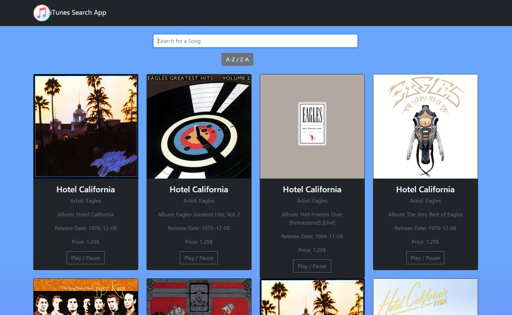

# iTunes Search App

App Preview

## Run

In the project directory, you can run:

### `npm start`

Runs the app in the development mode.
Open [http://localhost:3000](http://localhost:3000) to view it in the browser.

## Basic Use
You can search for your song by enter the name in the search bar and submitting by hitting
### `Enter`
You can order alphabetically (asc or desc) the list of songs by pressing the button
## `A-Z / Z-A`
Also yo are able to play or pause a specific song with the button
### `Play/Pause`

## Warnings

- The iTunes API has limited uses per day. In case you are receiving a 403 error, that is probably why
- Try not to play more than one song at a time :)

